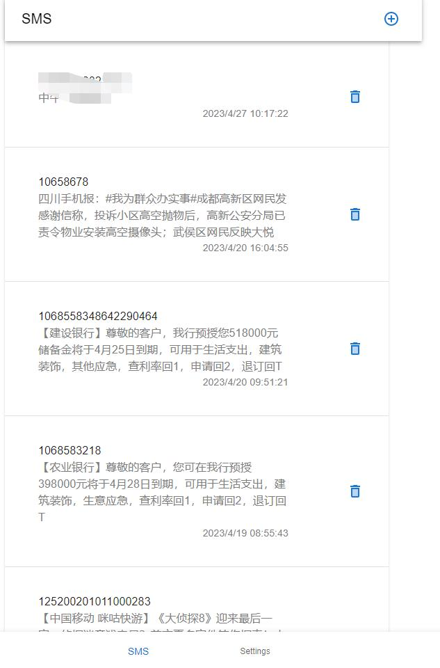
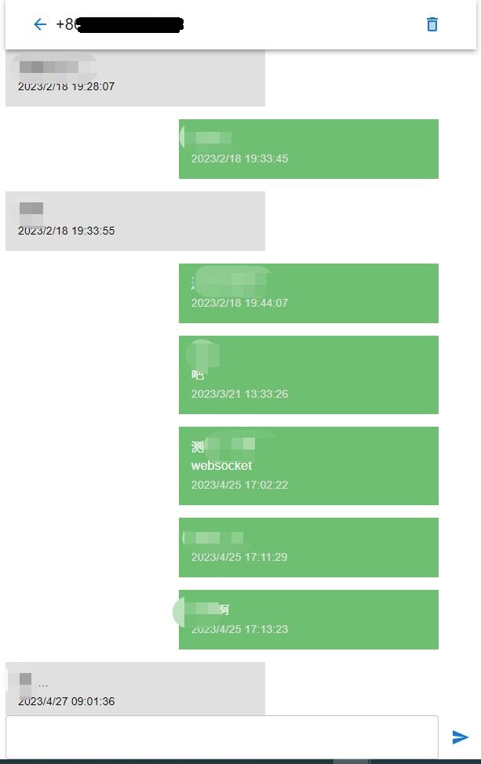

<div align="center">

# Gammu-Web

Gammu-Web is a wrapper for [libGammu](https://github.com/gammu/gammu) with WebUI.

[](https://github.com/ctaoist/gammu-web/blob/master/LICENSE)

|  |  |
| ------------------------ | ----------------------------- |

</div>

## Features

- WebUI by [React](https://react.dev/)
- Http api
- Websocket server
- A single binary with embed static files

## Prerequisite

Need install [Gammu](https://github.com/gammu/gammu) and [configure the gammu](https://docs.gammu.org/quick/index.html#installing-gammu).

```sh
apt install libgammu-dev
```

## Usage

```
gammu-web -h

Usage of ./gammu-web:
  -debug
        Debug mode
  -gammu-conf string
        Gammu config file (default "~/.gammurc")
  -log string
        Log to file, default to stdout
  -port string
        Server listen port (default "21234")
  -test
        Test mode, and not start gammu service
  -token string
        Api access token
```

## Development

```sh
# Firstly, clone the repo from github
git clone https://github.com/ctaoist/gammu-web.git

# build golang progarm
go mod tidy
go build -ldflags "-s -w"

# build react src
cd gammu-web/src-web
npm install -g vite
npm install
vite build

# dev run, need run golang program at first.
vite
```

## API

### get_phone_info

example: `/api/get_phone_info?token=xxxxx`

response:

| Filed       | Type   | Description                |
| ----------- | ------ | -------------------------- |
| `ownNumber` | string | The number of the SIM card |

### send_sms

request:

| Filed    | Type   | Description                    |
| -------- | ------ | ------------------------------ |
| `number` | string | Send SMS to the phone `number` |
| `text`   | string | The content to send            |

example: `/api/send_sms?token=xxx&number=xxxxxx&text=1234gammu`

response:

```json
{
  "retCode": 0,
  "errorMsg": ""
}
```

### get_messages

request:

| Filed    | Type   | Description                                                         |
| -------- | ------ | ------------------------------------------------------------------- |
| `number` | string | The phone `number` to get sms                                       |
| `page`   | int    | The page to request. There is 20 messages per page. Default is `0`. |

example: `/api/get_messages?token=xxx&number=xxxxxx&page=0`

response:

```json
{
    "retCode": 0,
    "errorMsg": "",
    "data": [Msg{}, ...]
}
```

`Msg{}`:

| Filed         | Type   | Description                   |
| ------------- | ------ | ----------------------------- |
| `id`          | string | The id of msg                 |
| `self_number` | string | The number of the SIM card    |
| `number`      | string | The phone `number` to get sms |
| `text`        | string | The content of sms            |
| `sent`        | bool   | Send or Receive sms           |
| `time`        | int64  | The time stamp                |

### delete_sms

request:

| Filed    | Type   | Description                  |
| -------- | ------ | ---------------------------- |
| `number` | string | The phone `number` to delete |

example: `/api/delete_sms?token=xxx&number=xxxxxx`

response:

```json
{
  "retCode": 0,
  "errorMsg": ""
}
```

### log

e.g.: `/log?token=xxxxxxxxx`

### clear_log

e.g.: '/api/clear_log?token=xxxxxx'

## License

This software is released under the [GPL2.0](https://github.com/ctaoist/gammu-web/blob/master/LICENSE) license.
